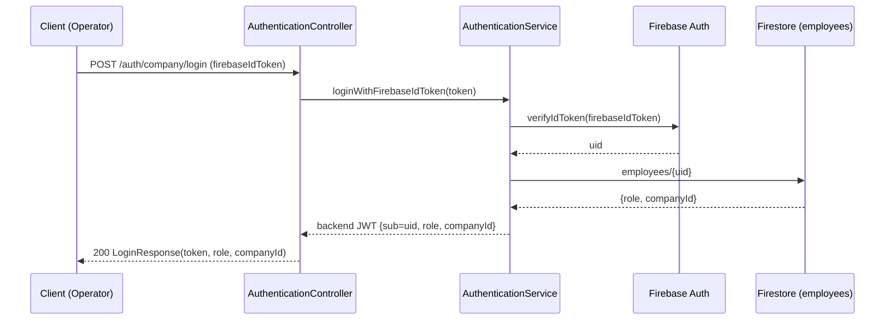
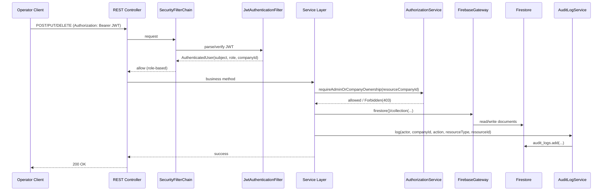
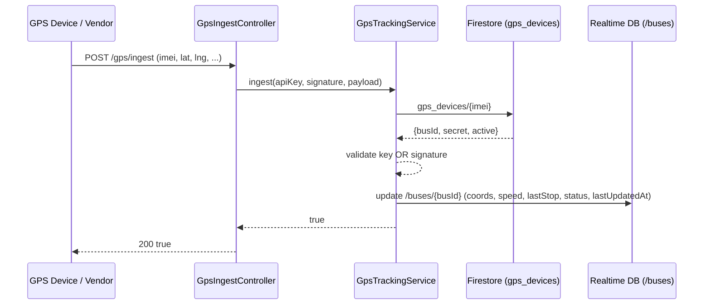
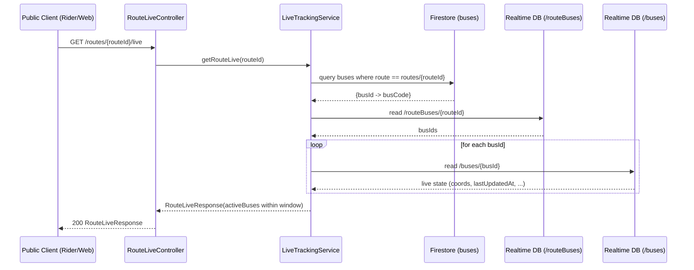

# BusBuddy Backend 🚍


A production-oriented backend powering **BusBuddy** — a smart bus operations and tracking platform.

It supports route lifecycle management, stop management, bus assignment, live operations workflows, delay analytics, and secure multi-tenant access control (company ownership + admin access).

---

**Known issues / audit:** see [`AUDIT.md`](./AUDIT.md).

## ✨ Why this backend stands out

- **Secure by design**: JWT auth + role-aware access + ownership checks
- **Built for real operations**: route history, stop progression, delay computation, live data integrations
- **Cloud-native persistence**: Firebase Firestore + Realtime Database + Firebase Auth
- **Battle-tested integration suite**: 44 passing tests covering auth boundaries, ownership behavior, validation, and integration flows

---

## 🧱 Architecture

The backend has 4 main runtime flows. Splitting them makes it easier to understand and troubleshoot.

### 1) Auth / Login flow (Firebase ID token → backend JWT)



### 2) Protected operator write flow (JWT + ownership → Firestore + audit)



### 3) GPS ingest flow (device/vendor → auth → RTDB live update)



### 4) Public live tracking flow (route → active buses)



### Layered design

- **Controller layer**: API endpoints and request orchestration
- **Service layer**: business rules and ownership-aware mutations
- **Security layer**: authentication + authorization boundaries
- **Persistence gateway**: Firebase integrations encapsulated behind gateway/util classes
- **DTO layer**: API contracts decoupled from internal persistence models

---

## 🔐 Security model

### Authentication
- Bearer JWT required for protected endpoints.
- Missing/invalid/expired JWT → **401 Unauthorized**.

### Authorization
- Role-based access (`ADMIN`, `COMPANY`) on protected routes.
- Authenticated user without required privileges → **403 Forbidden**.

### Ownership policy
- `COMPANY` users can mutate only their own resources.
- `ADMIN` can operate across companies where policy allows.

---

## 🛠 Tech stack

| Layer | Technology |
|---|---|
| Language | Java 21 |
| Framework | Spring Boot 3.2.3 |
| Security | Spring Security + JWT (JJWT) |
| Validation | Jakarta Validation |
| API Docs | springdoc-openapi + Swagger UI |
| Data Store | Firebase Firestore |
| Live State | Firebase Realtime Database |
| Identity | Firebase Auth |
| Build Tool | Maven Wrapper |

---

## 📂 Project structure

```text
src/main/java/com/chhavi/busbuddy_backend/
  config/         # typed config + infra setup
  constant/       # enums/constants
  controller/     # REST endpoints
  dto/            # request/response contracts
  exception/      # exception types + global handler
  gateway/        # Firebase integration entrypoint
  persistence/    # Firebase initialization + internal models
  security/       # JWT filter + security config + authorization services
  service/        # business logic
  util/           # validation, mapping, Firestore helpers

src/test/java/com/chhavi/busbuddy_backend/
  # integration + unit tests
```

---

## ⚙️ Configuration

Set these environment variables before running.

### Security note (important)
- Do **not** commit `.env` or Firebase service account JSON files.
- Use `.env.example` as a template for local development.
- Store credentials outside the repo and provide them via environment variables.
- This repository is configured to ignore `.env`, `secrets/`, and `target/` via `.gitignore`.


### Required

```env
APP_SECURITY_JWT_SECRET=<min-32-char-secret>
FIREBASE_DATABASE_URL=https://<project>.firebaseio.com/
FIREBASE_SERVICE_ACCOUNT_PATH=E:/path/to/service-account.json
```

### Optional

```env
APP_SECURITY_JWT_EXPIRATION_MS=604800000
APP_TIMEZONE=Asia/Kolkata
APP_CORS_ALLOWED_ORIGINS=http://localhost:3000
```

---

## 🚀 Run locally

### 1) Compile

```bat
mvnw.cmd compile
```

### 2) Run tests

```bat
mvnw.cmd test
```

### 3) Start app

```bat
mvnw.cmd spring-boot:run
```

Or run packaged jar:

```bat
mvnw.cmd package
java -jar target/BusBuddy_Backend-0.0.1-SNAPSHOT.jar
```

---

## 📘 API docs

Swagger/OpenAPI is the **source of truth** for endpoints and request/response shapes.

When running locally:

- Swagger UI: `http://localhost:8080/swagger-ui.html`
- OpenAPI JSON: `http://localhost:8080/api-docs`
- Health: `http://localhost:8080/actuator/health`

---

## 🔌 API examples

> Tip: A Postman collection is included, but if you notice mismatches, prefer Swagger (`/swagger-ui.html`) as the authoritative reference.

## 1) Company signup

### Request

```http
POST /companies/signup
Content-Type: application/json

{
  "email": "company@example.com",
  "password": "StrongPass123",
  "company": "company-a"
}
```

### Response

```text
Azienda registrata con successo con ID: <uid>
```

---

## 2) Search bus by number/name (public)

### Request

```http
GET /buses/search?query=101
```

### Response (example)

```json
[
  { "busId": "b123", "busCode": "BUS-101", "routeId": "r1a2", "routeCode": "Hajipur - Patna" }
]
```

### One-call live variant

```http
GET /buses/search-live?query=BUS-101
```

Example response:
```json
[
  {
    "busId": "b123",
    "busCode": "BUS-101",
    "routeId": "r1a2",
    "routeCode": "Hajipur - Patna",
    "live": {
      "busId": "b123",
      "busCode": "BUS-101",
      "coords": { "latitude": 12.9716, "longitude": 77.5946 },
      "speed": 23,
      "direction": "forward",
      "lastUpdatedAt": 1710000000000,
      "status": "RUNNING",
      "routeId": "r1a2"
    }
  }
]
```

---

## 3) Login (Firebase ID token -> backend JWT)

### Request

```http
POST /auth/company/login
Content-Type: application/json

{ "firebaseIdToken": "<firebase-id-token>" }
```

### Response

```json
{ "token": "<backend-jwt>" }
```

---

## 4) Verify backend JWT

### Request

```http
GET /verify-custom-token
Authorization: Bearer <jwt-token>
```

### Response

```json
true
```

---

## 5) Create route + stops (protected)

### Request

```http
POST /routes
Authorization: Bearer <backend-jwt>
Content-Type: application/json
```

```json
{
  "company": "company-a",
  "code": "10_A - B",
  "stops": {
    "forwardStops": [
      { "name": "Stop A", "address": "Addr 1", "coords": { "latitude": 12.9716, "longitude": 77.5946 } }
    ],
    "backStops": []
  }
}
```

### Response

```json
true
```

---

## 6) Set route timetable (minutes from start) (protected)

This defines how many minutes from the route start each stop is expected.

### Request

```http
POST /routes/{routeId}/timetable/minutes
Authorization: Bearer <backend-jwt>
Content-Type: application/json
```

Example (3 forward stops, 0 back stops):
```json
{
  "forwardMinutesFromStart": [0, 30, 90],
  "backMinutesFromStart": []
}
```

---

## 7) List routes (public-safe)

### Request

```http
GET /routes
```

### Response (example)

```json
[
  { "id": "r1a2", "code": "Hajipur - Patna", "stops": [ { "name": "Hajipur Bus Stand", "coords": { "latitude": 25.685, "longitude": 85.218 } } ] }
]
```

## 8) Route details (public-safe)

### Request

```http
GET /routes/{id}
```

Response includes only route `id`, `code` and stop list (`name` + `coords`).

---

## 9) Search routes (From → To) (public)

### Request

```http
GET /routes/search?from=Hajipur&to=Patna
```

### Response (example)

```json
[
  { "routeId": "r1a2", "routeCode": "Hajipur - Patna" }
]
```

### One-call live variant

```http
GET /routes/search-live?from=Hajipur&to=Patna
```

---

## 10) Live buses on a route (public)

### Request

```http
GET /routes/{routeId}/live
```

### Response (example)

```json
{
  "routeId": "route-1",
  "activeBuses": [
    {
      "busId": "bus-123",
      "busCode": "BUS-101",
      "coords": { "latitude": 12.97, "longitude": 77.59 },
      "speed": 22,
      "lastStop": 3,
      "direction": "forward",
      "lastUpdatedAt": 1710000000000,
      "status": "RUNNING"
    }
  ]
}
```

---

## 11) Add bus (protected)

### Request

```http
POST /buses?busCode=BUS-101&routeId=<routeId>
Authorization: Bearer <backend-jwt>
```

### Response

```json
true
```

---

## 12) Admin-only delay refresh

### Request

```http
POST /routes/delays/recompute
Authorization: Bearer <admin-jwt>
```

### Response

```json
true
```

---

## 13) Example error payload

```json
{
  "timestamp": "2026-03-10T04:01:15.756Z",
  "status": 401,
  "error": "Unauthorized",
  "message": "Missing or invalid Authorization header"
}
```

---

## ✅ Quality status

Current automated coverage includes:

- Auth boundary tests (missing/malformed/expired token)
- Role authorization tests (COMPANY vs ADMIN-only endpoints)
- Ownership behavior tests on protected mutations
- Validation and malformed request handling
- Config and utility unit tests

**Latest status:** 44 tests passing.

---

## 🧪 Security behavior reference

- Unauthenticated protected call → `401`
- Authenticated but insufficient role (e.g., COMPANY on ADMIN endpoint) → `403`
- Bad request payload/type mismatch/malformed JSON → `400`

---

## 🚢 Deployment notes

- Keep Firebase service account file outside repo
- Inject secrets via environment variables
- Restrict CORS origins for production
- Run behind HTTPS/reverse proxy in public deployment

See also:
- `DEPLOYMENT.md`
- `SECURITY_CLASSIFICATION.md`

### GPS device registration + ingestion (live bus tracking)

#### 1) Register a GPS device (IMEI) to a bus (OWNER/ADMIN)

`POST /companies/{companyId}/gps-devices`

Body:
```json
{ "imei": "123456789012345", "busId": "<busId>" }
```

Response includes a per-device `secret` (store it securely; configure device/vendor with it).

#### 2) Ingest location updates (public, authenticated by signature or legacy key)

To update bus live location, configure a GPS device (or vendor webhook) to POST updates to the backend.

**Preferred auth:** per-device HMAC signature header (replay-safe):
- Include `deviceTimestamp` in payload.
- Signature payload string:
  `imei|deviceTimestamp|latitude|longitude`
- Header:
  `X-GPS-SIGNATURE: <base64url(HMAC_SHA256(secret, payload))>`

Optional env var:
- `GPS_TIMESTAMP_WINDOW_SEC` (default 120)

**Legacy auth (fallback):** set env var `GPS_INGEST_API_KEY` and send:
- `X-GPS-KEY: <GPS_INGEST_API_KEY>`

Endpoints:
- Direct device (JSON): `POST /gps/ingest`
- Direct device (query params): `POST /gps/ingest/query?imei=...&lat=...&lng=...`
- Vendor webhook (JSON): `POST /webhooks/gps`

Payload example:
```json
{
  "imei": "123456789012345",
  "latitude": 12.9716,
  "longitude": 77.5946,
  "speed": 23,
  "direction": "forward",
  "lastStop": 3,
  "deviceTimestamp": 1710000000000
}
```

---

### Admin migration endpoint (legacy data)
If you have legacy data where `routes.company` / `buses.company` still contain the old company UID, an admin can migrate them:

- `POST /admin/migrations/company-id?legacyCompanyUid=<oldUid>&newCompanyId=<companyId>`

If you have older docs missing `searchKey` (and route `fromKey`/`toKey`) fields, an admin can backfill them:

- `POST /admin/migrations/search-keys`

Optional env var for large datasets:
- `MIGRATION_PAGE_SIZE` (1..500, default 500)

---

## 📑 Sample requests & responses

Full, maintained examples (two per endpoint) are stored as JSON under `docs/`:

- Base (Auth + Company + Employee): [`docs/sample_requests_responses.json`](./docs/sample_requests_responses.json)
- Routes: [`docs/sample_requests_responses.pass2a.json`](./docs/sample_requests_responses.pass2a.json)
- Stops: [`docs/sample_requests_responses.pass2b.json`](./docs/sample_requests_responses.pass2b.json)
- Route timetable: [`docs/sample_requests_responses.pass2c.json`](./docs/sample_requests_responses.pass2c.json)
- Route search + live: [`docs/sample_requests_responses.pass2d.json`](./docs/sample_requests_responses.pass2d.json)
- Buses: [`docs/sample_requests_responses.pass3a.json`](./docs/sample_requests_responses.pass3a.json)
- Bus search + live: [`docs/sample_requests_responses.pass3b.json`](./docs/sample_requests_responses.pass3b.json)
- GPS ingest: [`docs/sample_requests_responses.pass4a.json`](./docs/sample_requests_responses.pass4a.json)
- GPS ingest (query params): [`docs/sample_requests_responses.pass4b.json`](./docs/sample_requests_responses.pass4b.json)
- GPS device registration/listing: [`docs/sample_requests_responses.pass4c.json`](./docs/sample_requests_responses.pass4c.json)
- Audit logs: [`docs/sample_requests_responses.pass5a.json`](./docs/sample_requests_responses.pass5a.json)
- Admin migrations: [`docs/sample_requests_responses.pass5b.json`](./docs/sample_requests_responses.pass5b.json)

> Tip: Swagger (`/swagger-ui.html`) remains the source of truth for the exact API schema.

---

## 🗺 Roadmap (next phase)

- Standardize success response envelope across endpoints
- Tighten ownership-denial semantics consistently to `403`
- Add deterministic fixture-backed ownership integration tests
- Expand operational observability and audit logs

---

## 🤝 Contributing

1. Create a feature branch
2. Keep changes focused and tested
3. Run:

```bat
mvnw.cmd test
```

4. Submit PR with clear scope and impact notes

---

## License

MIT License — see [LICENSE](./LICENSE).
